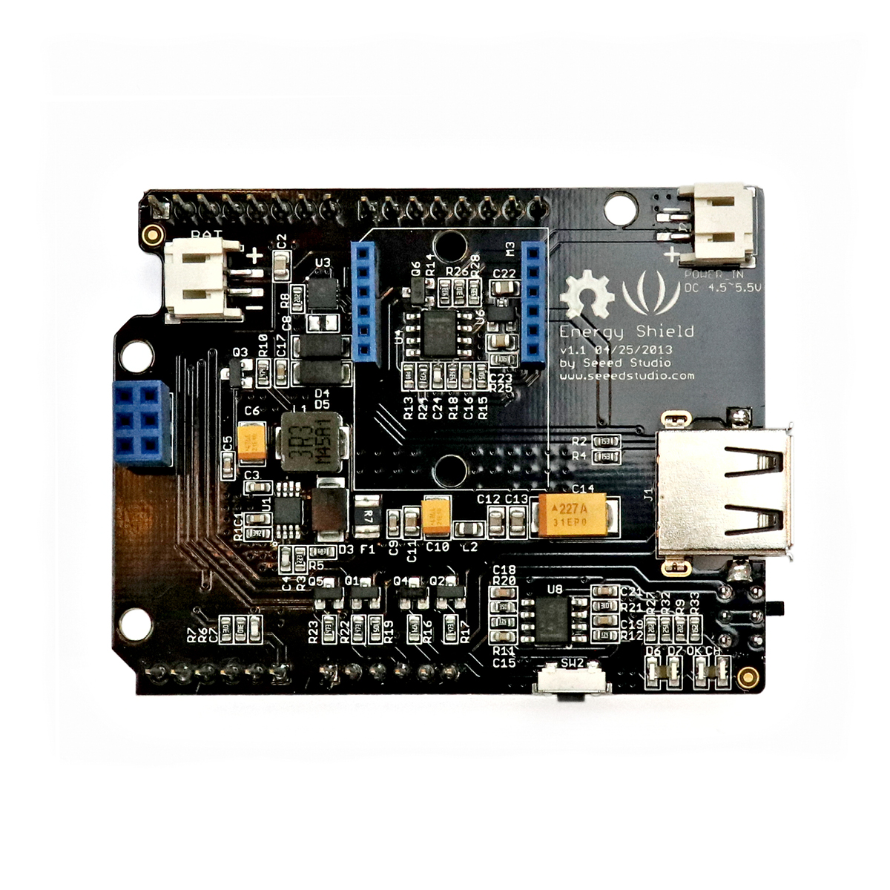

# Energy Shield

## Beschreibung
Das Energy Shield ist eine Erweiterungsplatine für Arduino-ähnliche Mikrocontroller. Diese Erweiterungsplatinen werden im Allgemeinen als „Shield“ bezeichnet und werden einfach auf den entsprechenden Controller oder Einplatinencomputer gesteckt. Diese vereinfachen das Anschließen von speziellen Komponenten enorm.

Diese spezielle Ausführung ermöglicht es, das eigene Projekt über ganz verschiedene Quellen mit Strom zu versorgen und angeschlossene Akkus zu überwachen und zu laden. Als Stromquelle kommen Solarpanels, Akkus oder Netzteile in Frage. Wird ein passender Akku angeschlossen, kann der sowohl geladen werden sowie als Spannungsquelle dienen, je nachdem welche Spannungsquellen noch angeschlossen sind. Zusätzlich kann die USB-Buchse genutzt werden, um jegliche andere Geräte (wie Smartphone oder Mikrocontroller) zu versorgen.

Mit diesem Modul kann beispielsweise ein solarbetriebenes Projekt realisiert werden: Ein Solarpanel wird als Hauptstromversorgung angeschlossen. Ein Li-Po-Akku dient als Zwischenspeicher und wird immer aufgeladen, sobald das Solarpanel genügend Strom erzeugt. Nun können Mikrocontroller angesteckt oder per USB mit Strom versorgt werden.

Alle weiteren Hintergrundinformationen sowie ein Beispielaufbau und alle notwendigen Programmbibliotheken sind auf dem offiziellen Wiki (bisher nur in englischer Sprache) von Seeed Studio zusammengefasst. Zusätzlich findet man über alle gängigen Suchmaschinen durch die Eingabe der genauen Komponentenbezeichnung entsprechende Projektbeispiele und Tutorials.

<!-- infolist -->

## Wichtige Links für die ersten Schritte:

- [Seeed Studio Wiki](http://wiki.seeedstudio.com/Energy_Shield/) [- Energy Shield](http://wiki.seeedstudio.com/Energy_Shield/)

## Weiterführende Hintergrundinformationen:

- [Lithium Polymer Akkumulatoren - Wikipedia Artikel](https://de.wikipedia.org/wiki/Lithium-Polymer-Akkumulator)

